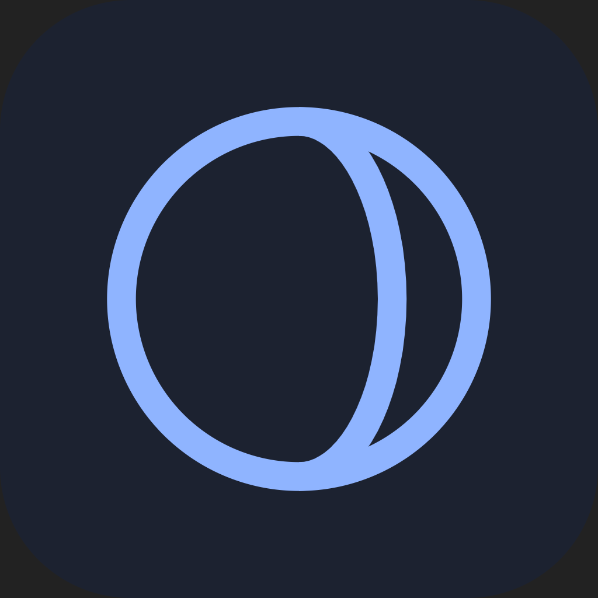

<p align="center">
  
</p>

<h1 align="center">Meridian</h1>

<p align="center">
  Multi-provider AI desktop client with coding agent capabilities.
  <br />
  <strong>Windows · Linux · Android</strong>
</p>

<p align="center">
  <a href="LICENSE">
    
  </a>
  <a href="https://github.com/Yuerchu/meridian-core">
    
  </a>
  
</p>

---

Meridian is a local-first AI client built with Tauri v2 (Rust + React). It
connects to multiple model providers, runs a full coding agent with tool
execution, and works as a desktop app, an Android companion, or a headless
bot on QQ.

## Features

**Multi-Provider AI**
&ensp; OpenAI · Anthropic · Google · DeepSeek · xAI (Grok) · Ollama
&ensp; — prefix cache optimization, exact Decimal billing, per-provider balance tracking.

**Coding Agent**
&ensp; Tree-structured conversation with branching, durable prompt queue (survives
crashes), sub-agent delegation, and a plan-document workflow with inline review.

**Tool System**
&ensp; Built-in file I/O, search, shell execution, web search, and persistent memory.
Extend via [MCP](https://modelcontextprotocol.io/) servers or host
[Claude Code](https://docs.anthropic.com/en/docs/claude-code) sessions natively (ACP).

**Sandboxing**
&ensp; Windows restricted-token sandbox, Docker container sandbox per conversation,
and dual-model automatic approval review for risky operations.

**OneBot / QQ Integration**
&ensp; Headless bot runner over WebSocket (OneBot v11) with group/private chat,
voice transcription (sherpa-onnx), voice replies (Fish Audio), and
privacy-compliant voice capture with GDPR "forget me" support.

**Remote Access**
&ensp; Desktop hosts an HTTP + WebSocket server — open Meridian's full UI from any
phone on your LAN with real-time sync and mobile approval handling.

**Cross-Platform UI**
&ensp; React 19 + Tailwind CSS v4 + React Aria. One responsive shell for every screen
size, with messenger-style bubbles, smart tool-call folding, and a custom
live-following transcript scroller.

## Platforms

| Platform | Package | Notes |
|----------|---------|-------|
| Windows  | EXE / MSI | Primary desktop target. Full sandbox support. |
| Linux    | AppImage | `.deb`/`.rpm` excluded due to sherpa-onnx rpath issues. |
| Android  | APK | Full mobile companion with Kotlin bridge and SAF file access. |

## Getting Started

### Prerequisites

- [Node.js](https://nodejs.org/) ≥ 22.18
- [pnpm](https://pnpm.io/)
- [Rust](https://www.rust-lang.org/tools/install) (stable, edition 2024)
- Platform build tools:
  - **Windows**: Visual Studio C++ Build Tools (MSVC)
  - **Linux**: `libwebkit2gtk-4.1-dev`, `libappindicator3-dev`, `librsvg2-dev`,
    `patchelf`, `libasound2-dev`

### Build & Run

```bash
# Clone with submodules (required — meridian-core lives there)
git clone --recurse-submodules https://github.com/Yuerchu/meridian.git
cd meridian

# Install frontend dependencies
pnpm install

# Launch in development mode
pnpm tauri dev
```

> [!NOTE]
> If you cloned without `--recurse-submodules`, run
> `git submodule update --init` before building.

### Android

```bash
# sherpa-onnx-sys downloads the Android libraries on its own
rustup target add aarch64-linux-android   # once, for the pinned toolchain
pnpm tauri android build --target aarch64 --apk
```

### Tests & Quality Gates

```bash
# Frontend
pnpm lint && pnpm typecheck && pnpm test

# Backend (shell — 22 tests)
cd src-tauri && cargo clippy --workspace --all-targets -- -D warnings && cargo test

# Backend (core — full suite)
cd src-tauri/crates && cargo test --workspace --target-dir ../target

# Contract & schema checks
pnpm contracts:check && pnpm responses:check
```

## Architecture

```
meridian (this repo, AGPL-3.0)
├── src/                          React 19 frontend
├── src-tauri/src/                Tauri shell: commands, IPC, platform
└── src-tauri/crates/             ← git submodule (Apache-2.0)
    └── meridian-core/
        ├── agent/engine/         Turn loop & tool dispatch
        ├── db/                   SQLite persistence
        ├── provider/             Multi-provider streaming
        ├── tools/                Built-in tool implementations
        ├── mcp/                  MCP client
        ├── onebot/               QQ bot runner
        └── hooks/                Hook-based review gates
```

The [meridian-core](https://github.com/Yuerchu/meridian-core) submodule is an
independent Apache-2.0 library containing everything framework-free — the agent
engine, database, providers, tools, MCP, and runners. This repository is the
Tauri desktop shell and React frontend that wires it all together.

## Contributing

See [CONTRIBUTING.md](CONTRIBUTING.md) for coding conventions and local checks.

All contributions require a [Contributor License Agreement](.github/CLA.md) —
you retain copyright, but grant the project the right to distribute your work
under both the AGPL and commercial licenses.

## License

This repository is dual-licensed. See [LICENSING.md](LICENSING.md) for the
full details.

- **Open source**: [AGPL-3.0-or-later](LICENSE)
- **Commercial license**: Available for proprietary use — contact
  admin@yuxiaoqiu.cn
- **meridian-core submodule**: [Apache-2.0](https://github.com/Yuerchu/meridian-core/blob/main/LICENSE)
  (independently licensed)

Third-party attributions are listed in [NOTICE](NOTICE).

---

<p align="center">
  Copyright © 2026 于小丘 Yuerchu
</p>
